# PlantUML-StateChart-To-Python

# Literaturrecherche

## Paper
Code Generation from UML State Chart Diagrams (wichtig, das Paper aus der VL)
- https://ieeexplore.ieee.org/document/9827649
- Musterbasierter Ansatz zur Code-Generierung aus UML-Statecharts, inkl. hierarchischer, paralleler und History-Zustände.​
- Nutzt eine Erweiterung des State-Patterns (Komposition/Delegation) und definiert explizite Mapping-Regeln von Statechart-Elementen zu Code-Templates.​
- UML zu Java

Code Generation from UML Statecharts
- https://community.wvu.edu/~hhammar/rts/adv%20rts/statecharts%20patterns%20papers%20and%20%20examples/statechart%20pattern%20and%20example%20niaz_sea2003.pdf
- objektorientiert: 1 State = 1 Klasse
- Ebenso Erweiterung des State-Patterns um Komposition und Delegation
- parallele Zustände, Forks/Joins, History-Zustände

Automatic Code Generation From UML State Chart Diagrams
- https://ieeexplore.ieee.org/document/8600324
- Stellt ein neuartiges Design-Pattern für die Implementierung von Statecharts mit Hierarchie, Parallelität und History-Zuständen vor.​
- Beschreibt Architektur und Ablauf eines Code-Generators von UML-State Machines sowie Vergleich mit anderen Tools.​
- Gut geeignet, um Design-Patterns und Generator-Architektur mit unserem Ansatz (PlantUML → Python) zu vergleichen

Complete Code Generation from UML State Machine
- https://www.scitepress.org/papers/2017/62745/62745.pdf​
- Liefert ein Muster und Tooling für „vollständige“ Code-Generierung aus UML-State Machines inklusive Pseudostates (History, Junction, Event-Typen) und Nebenläufigkeit.​
- Erweitert einfache if/else- oder switch-basierte Generierung mit expliziter Unterstützung für Nebenläufigkeit.​
- Sehr relevant, um komplexere UML-Statechart-Features (History, Concurrency) in Python abzubilden

AUTOMATIC CODE GENERATION FROM UML DIAGRAMS: THE STATE-OF-THE-ART
- https://www.scienceworldjournal.org/article/view/18891
- Systematic literature review (SLR) using the keywords “automatic code generation”, “MDE”, “code generation” and “UML” is used to identify 40 research papers published during the years 2000–2016

PROGRAM CODE GENERATION BASED ON UML STATECHART MODELS
- https://www.semanticscholar.org/paper/PROGRAM-CODE-GENERATION-BASED-ON-UML-STATECHART-Pintér-Majzik/e14d2b57537796cf46a3897d68f1566ab67e04c2
- Beschreibt eine Implementierungsstrategie auf Basis der Transformation von UML-Statecharts zu „Extended Hierarchical Automata
​- Fokus auf systematischer Transformation und darauf basierender automatischer Code-Generierung.​
- eigt, wie man formale Zwischenrepräsentationen für robustere Generierung nutzt (eher weniger relevant)

AUTOMATIC CODE GENERATION BASED ON FORMALLY ANALYZED UML STATECHART MODELS
- https://www.semanticscholar.org/paper/AUTOMATIC-CODE-GENERATION-BASED-ON-FORMALLY-UML-Pintér-zik/4a72dae2971bd0ca505b5dfb4329639725640d3c
- Baut auf vorheriger formaler Analyse von UML-Statechart-Modellen auf und nutzt erweiterte Statecharts als Basis für die Code-Generierung.​
- Betont die Kopplung von Verifikation/Analyse und automatischer Code-Erzeugung.​
- Relevanz: gut, wenn formale Korrektheit bzw. Analyse (z.B. Modelchecking) vor der Generierung wichtig

A Platform Independent Framework for Statecharts Code Generation
- https://accelconf.web.cern.ch/icalepcs2011/papers/weaault03.pdf​
- Beschreibt ein plattformunabhängiges Framework, das aus UML-State Machines SCXML-Repräsentationen und Anwendungsskelette generiert.​
- Trennung von Modell (Statecharts), Zielplattform und Code-Skeletten; SCXML als Zwischenformat.​
- Relevanz: zeigt, wie ein mehrstufiger Ansatz (UML → SCXML → Code) aussieht, was auf PlantUML → Python übertragen werden kann

A systematic review of code generation proposals from state machine specifications
- https://www.sciencedirect.com/science/article/abs/pii/S0950584912000924​
- Systematischer Review zu Code-Generierung aus Zustandsmaschinen, inkl. Klassifikation von Ansätzen, Zielen und Abdeckungsgrad von Statechart-Features.​
- Relevanz: hilft, den Ansatz im Forschungskontext einzuordnen und Lücken/Best Practices zu erkennen

Design and validation of a C++ code generator from Abstract State Machines specifications
- https://onlinelibrary.wiley.com/doi/10.1002/smr.2205​
- Beschreibt Asm2C++: einen Code-Generator, der C++-Code aus Abstract State Machine-Spezifikationen erzeugt und diesen experimentell validiert.​
- Relevanz: zeigt, wie man Codegeneratoren experimentell bewertet und die Korrektheit von generiertem Code argumentiert

## Github Projekte

StateBuilder (GitHub)
- https://github.com/stateforge/StateBuilder​
- State machine code generator für C++, C#, Java und andere Sprachen; liest State-Machine-Beschreibungen (XML) und erzeugt ausführbaren Code.​
- Relevanz: Referenzimplementierung für Generatorarchitektur, Konfigurationsformate und generierten Code-Stil.

PlantUML Statecharts (State Machine) Translator (GitHub)
- https://github.com/Lecrapouille/PlantUMLStatecharts​
- Übersetzt PlantUML-Statecharts in C++-Code (inkl. Unterstützung für hierarchische und parallele Zustände).​
- Relevanz: direktester technischer Verwandter

Python Code Generation for Multi State Machines (itemis CREATE Beispiel)
- https://www.itemis.com/en/products/itemis-create/documentation/examples/itemis-create-examples-codegen-multism-python​
- Demonstriert Python-Code-Generierung für mehrere interagierende State Machines mit itemis CREATE.​
- Relevanz: konkrete Python-Zielsyntax, Struktur von generiertem State-Machine-Code und Best Practices für Multi-Statemachine-Szenarien.

Github: StateSmith
- https://github.com/StateSmith/StateSmith
- Cross-Platform State-Machine-Generator für viele Zielsprachen (C, C++, C#, Java, Python, JS/TS etc.) mit Input aus draw.io, PlantUML, yEd.
- Relevanz: zeigt, wie man PlantUML-Input verallgemeinert und Multi-Sprachen-Codegeneratoren strukturiert; auch als technische Benchmark interessant
- direkter Konkurrent!!!

Python StateMachine (Python Bibliothek)
- https://pypi.org/project/python-statemachine/
- Reife Python-Bibliothek für State Machines
- Nicht direkt ein Generator
- Diagramm-Generierung aus Code (Umkehrung des Ansatzes, aber relevant für Patterns)

State Machine Code Generation in Python (Gnosis Whitepaper)
- http://www.breti.org/resources/Grass-Roots-Code-Generation/State_Machine_Code_Generation_in_Python_1.0_gnosis.pdf​
- Beschreibt, wie man aus Modellbeschreibungen (z.B. XML) State-Machine-Code generiert, mit Fokus auf Python-Implementierung und Code-Struktur.​
- Relevanz: direkt Python-bezogen; liefert Patterns für die Generierung und Organisation des Python-State-Machine-Codes.

# Weitere Ansätze
- SCXML (State Chart XML) als Zwischenformat
    - scxml4py – Python SCXML Interpreter mit API (https://github.com/Open-MBEE/scxml4py)
    - PlantUML → SCXML Parser → Python Code
    - Das ermöglicht standardisierte Verarbeitung und ist besser wartbar
- Parsing und AST-Techniken
    - Python AST Module - Für das Verständnis von AST-Strukturen in Python
    - Abstract Syntax Networks for Code Generation – Theoretischer Hintergrund zu AST-basierter Code-Generierung (https://arxiv.org/pdf/1704.07535)
- "LLMs as Code Generators for Model-Driven Development" – Zukunfts-relevant: Einsatz von ChatGPT/LLMs für MDD-Code-Generierung (https://www.scitepress.org/Papers/2025/135803/135803.pdf)

# UML Statechart Features (nach Komplexität)

## Basis

- **Einfache Zustände (simple states)**
  - Einzelner Zustand ohne interne Struktur
  - Optional mit `entry` / `do` / `exit` Aktionen

- **Transitionen**
  - Kanten mit Quelle/Ziel
  - Optional mit Ereignis, Guard `[cond]` und Aktion/Effekt

- **Ereignisse (Events)**
  - z.B. Signal-, Call-, Zeit- oder Change-Events

- **Initial- und Endzustand**
  - Start-Pseudostate (gefüllter Punkt)
  - Finaler Zustand (Bullseye)

## Mittlere Komplexität

- **Interne Aktionen eines Zustands**
  - `entry /`, `do /`, `exit /`
  - Interne Transitionen ohne Zustandswechsel

- **Guards (Bedingungen)**
  - Boolesche Ausdrücke auf Transitionen

- **Aktionen auf Transitionen**
  - Code / Operationen, die beim Übergang ausgeführt werden

- **Selbsttransitionen / interne Transitionen**
  - Übergang zurück in denselben Zustand (mit oder ohne Re-Entry)

- **Zusammengesetzte Zustände (Composite States, einfach)**
  - Zustand mit eigener interner Sub-Statemachine (ohne Parallelität)

## Fortgeschritten

- **Mehrstufige Hierarchie**
  - Zustände innerhalb von Zuständen über mehrere Ebenen

- **Regionen in zusammengesetzten Zuständen**
  - Strukturierung der Sub-States in logische Regionen

- **Submaschinenzustände (Submachine States)**
  - Wiederverwendung einer separaten State Machine als „Inline“-Zustand

- **Deferierte Ereignisse (Deferred Events)**
  - Ereignisse, die im aktuellen Zustand geparkt und später verarbeitet werden

- **Zeitereignisse (Time Events, `after` / `at`)**
  - Zeit- oder Timeout-basierte Trigger

## Pseudostates (fortgeschritten bis komplex)

- **Choice / Junction**
  - Verzweigung/Zusammenführung mit mehreren Guards

- **Fork / Join**
  - Aufspalten und Synchronisieren paralleler Pfade

- **Terminate-Pseudostate**
  - Sofortiges Beenden der gesamten State Machine

## Höchste Komplexität

- **Nebenläufige Regionen (Orthogonal Regions)**
  - Mehrere gleichzeitig aktive Regionen in einem Composite State

- **History-Zustände (Shallow / Deep History)**
  - Wiedereinstieg in den zuletzt aktiven Unterzustand
  - Shallow: nur eine Ebene; Deep: rekursiv über alle Ebenen

- **Entry-/Exit-Points (Entry/Exit Pseudostates)**
  - Spezielle Ein/Austrittspunkte für Composite- oder Submachine-States

- **Broadcast-Events / Ereignisverteilung zwischen Regionen**
  - Events beeinflussen mehrere Regionen/Teilautomaten gleichzeitig

- **Kombination von Hierarchie und Parallelität**
  - Verschachtelte Composite-States mit eigenen parallelen Regionen und History

## Our Chosen PlantUML Subset
Listed below are the features selected for our custom PlantUML subset. This includes the exact syntax that must be strictly followed to ensure stable parsing.

### Simple State
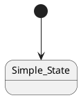
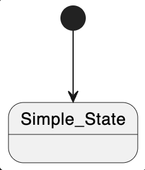

### Composite State
**Keep in mind:** We only allow shallow composite state, which means you can only put simple states into composite states, not other composite states.
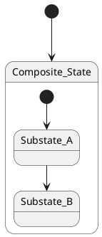
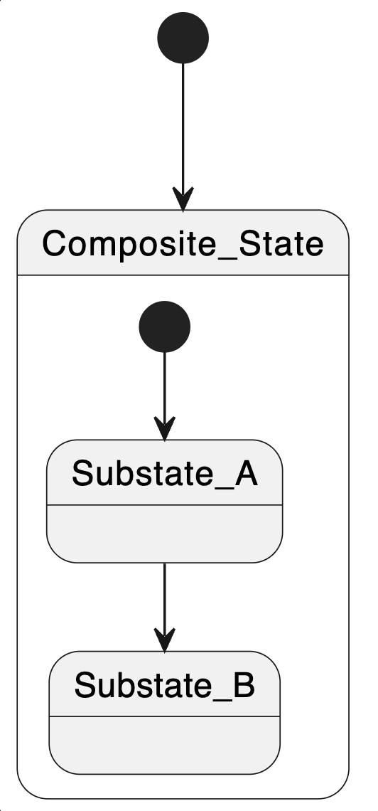

### History State
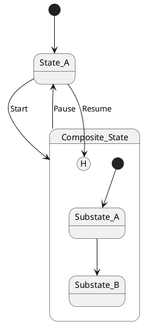
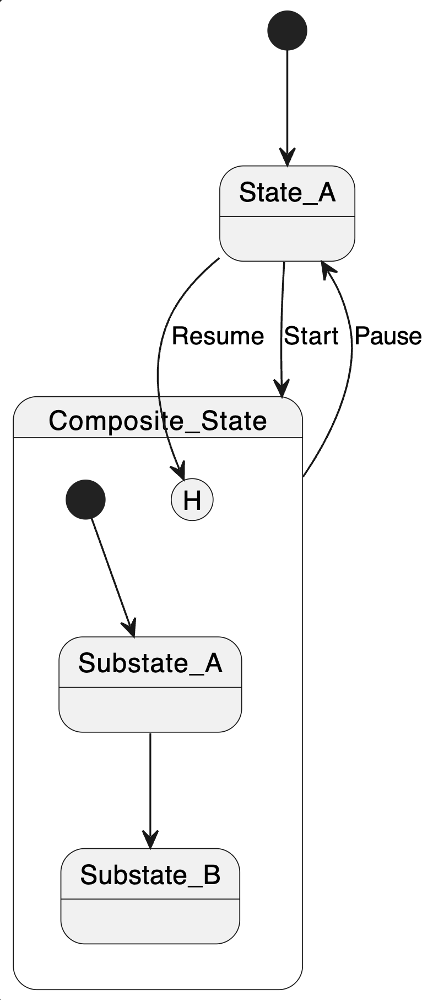

### Transition + Guards
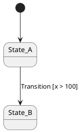
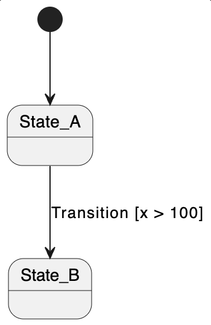

### Entry/Exit Action
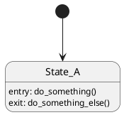
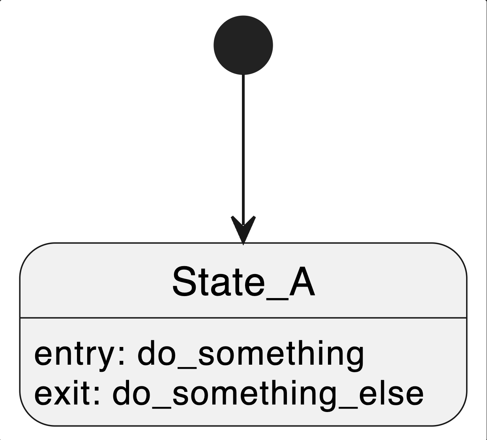

### Example State Machine Using PlantUML

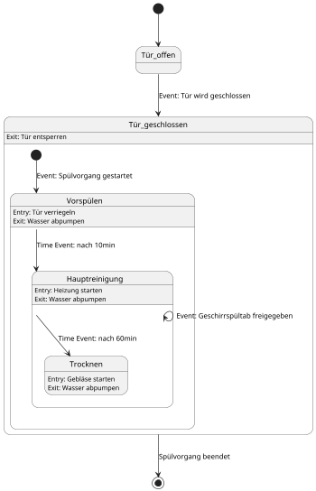
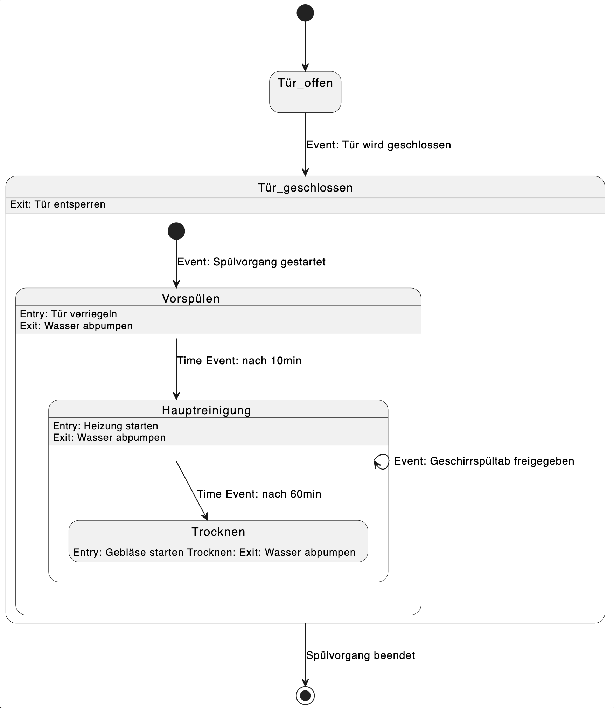

# Using this Repository

## Rendering PlantUML Code

To render PlantUML Code you have 2 options:
1. Use the [PlantUML Webserver](https://www.plantuml.com/) in your Browser
2. Use an extension for PlantUML support like [this](https://marketplace.visualstudio.com/items?itemName=jebbs.plantuml) in VSCode. If you're on Mac, you will have to have Java installed and need to run those commands in order for it to work properly: `brew install --cask temurin` and `brew install graphviz` 

