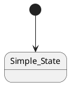
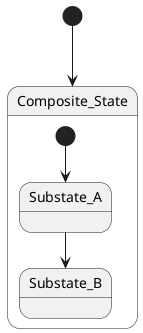
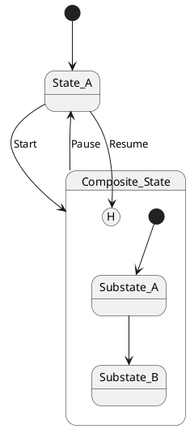
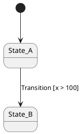
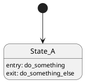
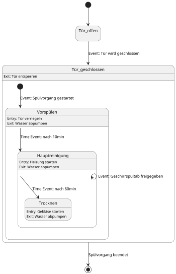

## Our Chosen PlantUML Subset
Listed below are the features selected for our custom PlantUML subset. This includes the exact syntax that must be strictly followed to ensure stable parsing.

### Simple State

### Composite State
**Keep in mind:** We only allow shallow composite state, which means you can only put simple states into composite states, not other composite states.

### History State

### Transition + Guards

### Entry/Exit Action

### Example State Machine Using PlantUML

